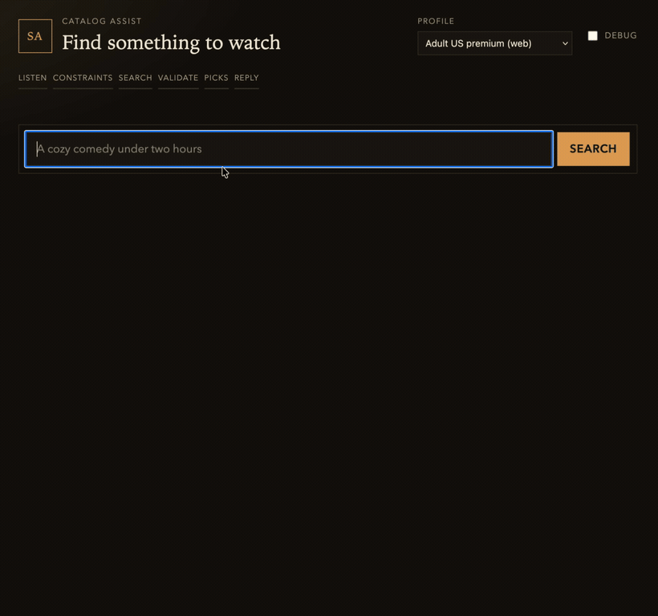
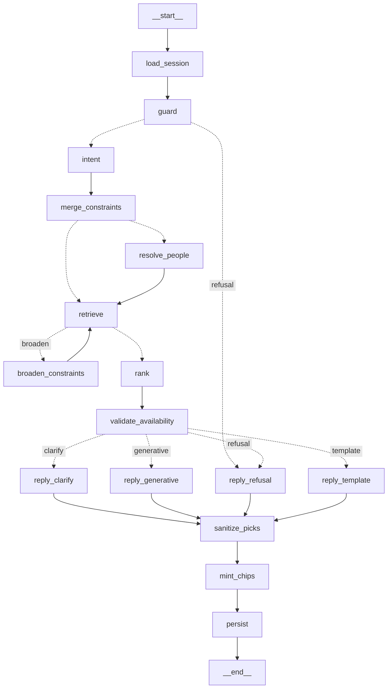

# streaming-assist

Grounded conversational search assist for a streaming catalog.

You type a vague query. The system returns catalog-grounded title picks, one short
reply, and tappable refinement chips.



One turn, unedited: the query resolves into sticky constraints (`comedy`,
`2000-2009`, one person), stages tick across as the graph runs, picks stream in,
and the chips offer grounded refinements. Constraints persist into the next turn.
[Full-resolution clip](docs/demo.mp4).

The model extracts intent and writes one sentence. It never picks the catalog. It
never names a title from memory. It never decides control flow.

Retrieval, ranking, availability, and constraint state are deterministic.

Everything runs in Docker. The host needs Docker and ~2.5GB of RAM. You do not
install Python, Elasticsearch, or a model on the host to run the demo.

## Quickstart

1. Clone the repo.

   ```bash
   git clone git@github.com:PetrJanousek/streaming-assist.git
   cd streaming-assist
   ```

2. Copy env defaults. Leave `ANTHROPIC_API_KEY` empty unless you want live LLM calls.

   ```bash
   cp .env.example .env
   ```

3. Start the stack and wait until it is healthy.

   ```bash
   make up-all
   # equivalent: docker compose up -d
   docker compose ps
   curl -fsS http://127.0.0.1:8000/healthz
   curl -fsS http://127.0.0.1:8000/readyz
   ```

4. Seed the catalog (fetch → normalize → enrich from the committed artifact → index).

   ```bash
   make seed
   # equivalent: docker compose --profile tools run --rm jobs seed-all
   ```

5. Send a turn. `dev-adult` is a seeded profile, not real auth.

   ```bash
   curl -sS http://127.0.0.1:8000/v1/assist/turn \
     -H "Authorization: Bearer dev-adult" \
     -H "Content-Type: application/json" \
     -d '{"message":{"type":"text","text":"a cozy comedy under 100 minutes"}}'
   ```

   The body is `{session_id, reply, picks, chips, meta}`. Use `session_id` on the next
   turn. Chip taps send `{session_id, message: {type: "chip", chip_id}}` — never a delta.

   Other fixture tokens: `dev-kids`, `dev-basic`. List them at `GET /dev/profiles`.

No API key is required for this path. Empty `ANTHROPIC_API_KEY` degrades to rules
intent + template replies. The turn still returns a body.

Ops runbook (scale, 429s, logs, degrade, reset): [`docs/runbook.md`](docs/runbook.md).

## Seeding

`make seed` runs `jobs seed-all`:

| Step | What it does | Network / cost |
|---|---|---|
| fetch | Downloads the Netflix titles CSV, verifies SHA-256, falls back to a committed 500-row sample | One HTTP GET; sample is offline |
| normalize | 8,807 titles and ~41k people into Postgres. 42 raw genres → ~20 `GenreId`s. Dirty rating rows are quarantined | No LLM |
| enrich | Writes moods/tags/audience onto `titles.enrichment`. Default `ENRICH=skip` imports `data/enriched/titles.jsonl` | $0 on the default path. `ENRICH=llm` is ~$1.75 for 2,500 titles |
| index | Embeds with `bge-small-en-v1.5`, bulk-writes `titles_vN` / `people_vN`, swaps aliases | Embedder is local. No external model call |

Re-run is idempotent. Enrich skips titles that already have a payload. Index writes a
new versioned index and keeps the previous one for rollback.

## Architecture

Six containers. The API is stateless. Session, chips, caches, and the rate-limit
bucket live in Redis, so `--scale api=3` does not change behaviour.

```
                         ┌──────────────┐
   browser ──────────────│  demo UI     │  (static page served by api)
                         └──────┬───────┘
                                │ POST /v1/assist/turn
                         ┌──────▼───────────────────────────────┐
      [scale: nginx]     │  api   FastAPI + LangGraph workflow  │
                         │  stateless, N replicas               │
                         └───┬────────┬─────────┬───────────┬───┘
                             │        │         │           │
                  ┌──────────▼──┐ ┌───▼─────┐ ┌─▼────────┐ ┌▼──────────┐
                  │ redis       │ │ elastic │ │ postgres │ │ embedder  │
                  │ session     │ │ BM25+kNN│ │ catalog  │ │ bge-small │
                  │ chips       │ │ RRF in  │ │ people   │ │ 384d CPU  │
                  │ caches      │ │ Python  │ │ avail.   │ │           │
                  │ rate limit  │ │         │ │          │ │           │
                  └─────────────┘ └─────────┘ └──────────┘ └───────────┘
```

This is a **workflow, not an agent**. Four invariants, enforced by `tests/test_graph_shape.py`:

1. Neither model call is given tools.
2. No conditional edge consults a model.
3. Exactly one cycle exists — `retrieve → broaden → retrieve` — bounded by a counter.
4. No LangGraph checkpointer. Cross-turn state is ours, in Redis.

The diagram below is generated from the compiled graph (`make graph`), not drawn by hand.



LangGraph is the workflow engine. LangChain is the model factory, structured output,
retry/fallback, and cost callback. There is no tool-calling loop and no model-directed
routing.

## What is synthetic

These fields are fixtures. They are not catalog facts.

| Field | Why it exists |
|---|---|
| Availability windows | ~85% playable now, ~7% expired, ~5% package-gated, ~3% geo-restricted. Deterministic hash of `catalog_id`. Lets `playable_now` drop titles you can observe. |
| `pop_28d` | Deterministic pseudo-random, skewed by recency and genre. Feeds the 0.50 ranker weight. |
| `local_original` | `HOME_COUNTRY` plus a deterministic 20%. |
| Seeded profiles | Bearer `dev-adult` / `dev-kids` / `dev-basic` stand in for auth, entitlement, and device registry. `client_hints` never reach `ServerUserCtx` or `playable_now`. |
| Moods, tags, audience, era | Not in the source CSV. Written by one structured Haiku call per title, or imported from the committed JSONL. |

Titles, people, credits, synopses, years, countries, and maturity ratings come from the
[Netflix Movies and TV Shows](https://huggingface.co/datasets/hugginglearners/netflix-shows)
CSV (8,807 rows). That part is real.

## Cost

Haiku 4.5 list price: **$1 / $5 per million tokens**.

| Call | When | Tokens in/out | Cost |
|---|---|---|---|
| IntentUpdate | Free-text that misses rules + cache | ~300 / ~150 | ~$0.0011 |
| GroundedGenerate | `GENERATIVE` route only | ~1,100 / ~180 | ~$0.0020 |
| Chip tap or rules hit | Most turns | 0 / 0 | **$0** |
| Enrichment (offline) | Once per title, default skip | ~350 / ~180 | ~$0.0013; 2,500 titles ≈ **$1.75** |

A worst-case online turn (both calls, cold cache) is **~$0.003**. Chip taps are free.

Set `LANGSMITH_TRACING=1` only if you accept shipping prompts and retrieved content to
an external service. Default is off.

## Model-tier comparison

`ANTHROPIC_MODEL` is one env var. A swap is a restart, not a code change.

Rates below are published list prices (USD per million tokens). The turn cost uses the
same token counts as the table in Cost (~1,400 in / ~330 out for both calls).

| `ANTHROPIC_MODEL` | Input | Output | Worst-case turn | Use |
|---|---|---|---|---|
| `claude-haiku-4-5` (default) | $1 | $5 | ~$0.003 | Production default. Structured intent + one-sentence reply. |
| `claude-sonnet-5` | $2 | $10 | ~$0.006 | Quality comparison. Same schemas, ~2× cost. |
| `claude-opus-5` | $5 | $25 | ~$0.015 | Upper bound. Not justified for this IO; included so the knob is honest. |

Template and chip paths stay at $0 on every tier — the router never calls the model.

Measured quality (recall@8, person@1, schema-fail rate, route mix) belongs in
`docs/eval-report.md` after you run `make eval`. This table is cost, not quality.

`LLM_PROVIDER=none` returns a stub that raises a typed `LLMUnavailable`. The graph
degrades. The process does not crash.

## Scale

The API is stateless. Prove it with three replicas behind nginx:

```bash
docker compose -f docker-compose.yml -f docker-compose.scale.yml \
  --profile scale up -d --wait --wait-timeout 180 --scale api=3
```

Then talk to `http://127.0.0.1/` (gateway). `api:8000` is unpublished.

- A session started on replica A continues on replica B. Session JSON lives at
  `sess:{session_id}` in Redis.
- The rate limiter is one Redis token bucket, not three. Burst is shared.
- nginx forwards `X-Request-Id` (or mints one) and echoes `X-Upstream-Addr` so you can
  see which replica served the request.

Suggested Makefile target `scale` is not in this repo yet (the eval task owns the
Makefile this stage). Use the `docker compose` command above. Details:
[`docs/runbook.md`](docs/runbook.md).

## Demo UI

The API serves a single-page demo at `/` (no build step): search input, streamed reply,
title cards, tappable chips that post `chip_id`. SSE frames are stage progress
(constraints → candidates → validated cards → reply), not tokens.

If `/` is 404, the UI task has not landed. Use the curl in Quickstart until it does.

## Eval

```bash
make eval
```

That writes `docs/eval-report.md` (recall@8, person@1, schema-fail rate, route mix,
degraded rate, latency p50/p95, USD per turn). The report header states which fields
are synthetic fixtures.

If `make eval` is missing, the eval task has not landed. The golden set and harness
live under `data/golden/` and `src/assist/jobs/eval.py` once that task merges.

## Commands

```bash
make up            # postgres, elasticsearch, redis
make up-all        # full stack
make seed          # fetch + normalize + enrich + index
make lint typecheck test
make eval          # golden set report (when the eval task has landed)
make graph         # regenerate docs/graph.mmd
make down          # stop, including tools + scale profiles
```

Host-side lint/test needs [uv](https://docs.astral.sh/uv/) and Python 3.12. The demo
does not.

## Documentation

| File | What it is |
|---|---|
| [`docs/implementation-plan.md`](docs/implementation-plan.md) | Architecture. Source of truth. |
| [`docs/WORKPLAN.md`](docs/WORKPLAN.md) | Task DAG for implementation agents |
| [`docs/design.md`](docs/design.md) | Original design (merge algebra, response contract, router) |
| [`docs/runbook.md`](docs/runbook.md) | How to run, scale, and debug |
| [`docs/graph.mmd`](docs/graph.mmd) | Compiled workflow, generated |
| [`CLAUDE.md`](CLAUDE.md) | Working agreement for agents |

## Stack

Python 3.12 · FastAPI · LangGraph · LangChain + Claude Haiku 4.5 · Elasticsearch 8.15
(BM25 + kNN, RRF fused in Python) · Postgres 16 · Redis 7 · `BAAI/bge-small-en-v1.5`
embeddings. Compose profiles: default, `tools` (jobs), `scale` (nginx gateway).
