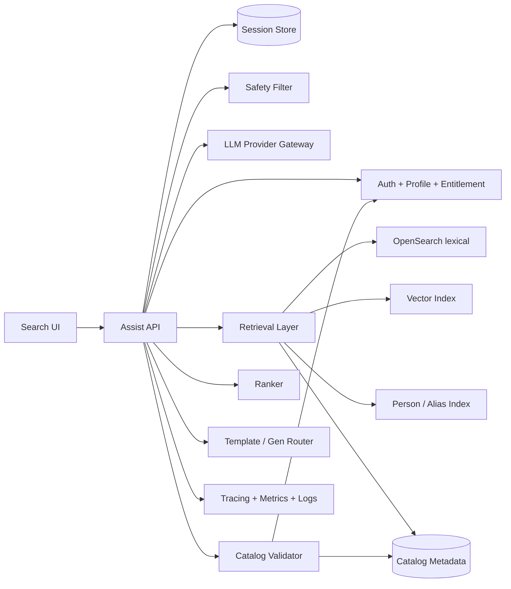
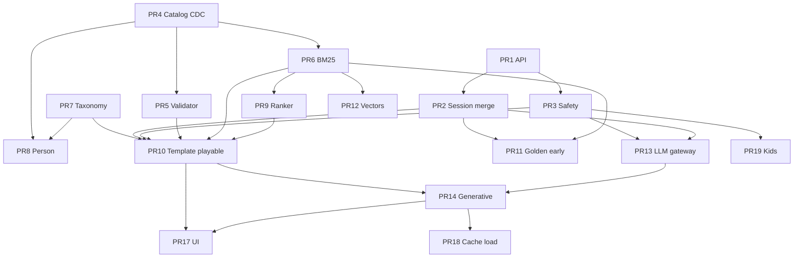

# Design: Conversational Search Assistant for Czech Streaming Platform

| Field | Value |
|-------|-------|
| **Author** | Systems Architecture (draft) |
| **Date** | 2026-07-19 |
| **Revised** | 2026-07-19 (review pass) |
| **Status** | Draft |
| **Audience** | Product engineering, platform, ML/infra, search |
| **Related** | Existing Search experience, Catalog service, Recommendation systems |

**Scale context:** The brief assumes a Netflix-like independent service with **several million subscribers**. That may include multi-country packaging under a Czech product core; figures below treat “Czech streaming platform at multi-million MAU / several million paid subs” as the planning envelope, not a claim about Czech-only household counts.

---

## Overview

This document proposes a **grounded conversational assist layer** inside the existing Search experience of a Netflix-like Czech streaming platform. Users express vague, multi-constraint, or cultural intent in Czech (“něco útulného na večer”, “ten špionážní film s tím starším chlápkem z 90. let”); the system returns a structured turn: **reply text**, **catalog-grounded title picks**, and **tap chips** for continuation — without becoming a standalone chatbot or breaking the path to playback.

The core technical bet is **LLM-as-planner, not LLM-as-catalog**. A Czech-capable model (at most **one paid generative call** on the success path) interprets intent and sticky constraints; retrieval and deterministic ranking produce candidates; a hard catalog validator ensures every recommended ID is **playable now** for the authenticated profile; structured decoding guarantees the response shape.

**Normative MVP hot path:**  
`AuthZ profile load → safety → IntentUpdate (rules or one structured LLM call) → merge constraints → retrieve+rank → route(template | grounded generative reply) → sanitize_picks (no LLM) → respond`.

We push back on a full multi-turn agent for MVP and on treating 5–10s as a product latency target (see Problem framing and Goals).

---

## 1. Problem framing

### What is the actual hard problem?

The hard problem is **not** “wire an LLM to search.” It is:

> Reliably map underspecified, conversational Czech intent into a small set of **currently playable** catalog titles, under tight latency and unit-economics constraints, while preserving multi-turn constraints and never inventing titles.

Standard keyword search fails when the query is preference-shaped rather than title-shaped. Recommendation carousels fail when the user wants a *dialogue* (refine, exclude, pivot). A chat-shaped LLM fails when it hallucinates titles, drifts constraints, answers in broken Czech, or costs more than the session is worth.

### Tensions that make this non-trivial to *build well*

| Tension | Why it hurts |
|--------|----------------|
| **Czech quality vs. model cost** | Czech has less pretraining mass than English. Models that sound natural and handle diacritics, morphology, and local culture (ČT, “české origály”, local celebrity aliases) are often larger/slower/pricier. Cheap English-first models will feel broken to native users — a quality gate, not a nice-to-have. |
| **Hallucination vs. helpfulness** | Free-form generation invents titles or silently substitutes similar English titles. Grounding must be hard (validator), not soft (prompt). |
| **Latency vs. multi-step intelligence** | Plan → retrieve → re-rank → generate is sequential. 5–10s end-to-end may be “acceptable” for a research agent; for **in-search assist** it feels broken. Users abandon or fallback to typing a title. |
| **Multi-turn stickiness vs. simplicity** | “Only local originals” must survive “and something funny” without re-asking. Full agent memory is powerful and expensive; over-engineering sticky state for MVP is a common failure mode. |
| **Scale economics** | ~1.2M conversations/day, peak ~150k conversations/hour (~42 conv/s → ~75 turns/s at 1.8 turns/conv). At even $0.01/turn this is **~$12k/day** (~$4.4M/year) before infra. |
| **Jailbreak & brand safety** | Assist sits on a family-friendly surface. Prompt injection, adult content bypass, competitor/piracy queries must fail closed without looking dumb. |
| **Catalog freshness** | Rights windows, geo, device, maturity rating, and regional packaging change continuously. Yesterday’s embedding index is a hallucination vector. |
| **Assist vs. chatbot product identity** | Standalone chat trains users to monologue and wait. In-search assist must feel like **smarter search**: short turns, chips, immediate title cards, one-tap play. |
| **Client trust vs. entitlements** | Any maturity/geo/package value accepted from the client is an AuthZ bypass. Context must be server-derived from the authenticated profile. |

### Pushback on the brief (explicit)

1. **5–10s E2E is too slow as a product target for in-search.** Treat ~8s as a hard *ceiling* for degraded responses, not the p50 goal. Target **p50 ≤ 2.0s, p95 ≤ 4.0s** on the **template + single-LLM** paths with progressive UI (skeleton → validated cards only). If provider p95 generative cannot land under ~1.5s, **route more traffic to templates** rather than normalizing 5–10s waits.

2. **Full multi-turn agent is the wrong MVP.** Sticky constraints + last-N turns + chips cover ~80% of value. Tool-calling loops, long-horizon planning, and open web knowledge are cost/latency traps for v1.

3. **1.2M conversations/day is a cost cliff.** Design for **aggressive caching, small models, template-first routing, and retrieval-first** paths. Assume many conversations are 1–2 turns.

4. **“Communicate in Czech” is not only an LLM problem.** Reply templates, chip phrases, genre taxonomies, and evaluation sets must be Czech-first.

5. **“Something cozy for tonight” is partly personalization.** MVP uses popularity + constraint match + semantic score **without** a taste vector; deep recsys fusion waits.

---

## Background & Motivation

### Current state (assumed product)

- **Search**: keyword / typeahead over titles, people, genres; good for known-item lookup.
- **Home / rows**: passive recommendations; weak for active intent refinement.
- **Catalog**: rights-managed; Czech + international content; local originals matter culturally and commercially.
- **No** first-class natural-language assist in Search today.

### Pain points

- Vague intent has nowhere to go except failed keyword search or endless scrolling.
- Local cultural references and fuzzy memory queries (“ten s tím chlápkem z 90. let”) are poorly served by token match.
- Product wants differentiation without building a full “AI companion” brand risk.

### Why now

LLM structured generation + hybrid retrieval make grounded NL search feasible; competitors will ship English-first experiences that underperform in Czech if we wait without investing in language quality.

---

## Goals & Non-Goals

### Goals

- **G1.** In-Search conversational assist with structured response every turn: `{ reply, picks[], chips[] }`.
- **G2.** Hard catalog grounding: every pick is **playable now** for the authenticated profile (`playable_now(user_ctx)`).
- **G3.** Czech-first UX quality with **numeric launch gates** (see Czech quality scorecard).
- **G4.** Sticky constraints across a short session with a defined merge algebra.
- **G5.** Latency: p50 ≤ 2.0s, p95 ≤ 4.0s, hard timeout 8s with degraded response; progressive UI never shows unvalidated IDs.
- **G6.** Cost-feasible at ~1.2M conversations/day: design target **≤ $0.003 median model+assist-infra $/conversation**, with routing sensitivity (see Cost model).
- **G7.** Jailbreak resistance and brand-safe refusals in Czech; **no user-visible path without safety module live**.
- **G8.** Observability: full trace per turn; cost and validator-drop alerts.

### Non-Goals (MVP)

- Standalone chatbot surface, voice, or multi-modal input.
- Open-web knowledge, cast trivia beyond catalog metadata, or plot spoilers as a product feature.
- Long-horizon memory across days/devices.
- Fine-tuning a foundation model from scratch.
- Replacing classic Search or Home rows.
- Recsys taste-vector parity (explicitly **no taste vector in MVP ranker**).
- Multi-language product surface: **Czech only** in MVP. Slovak input handling is deferred (see Open Questions); do not soft-accept SK without a QA track.

---

## 2. Proposed architecture

### High-level shape

**Pattern: Retrieve-then-generate (or template) with constraint state machine, server-side AuthZ context, and hard ID validation.**

```
Client (Search UI)
    │  POST /v1/assist/turn  (auth token; optional device/UI hints only)
    ▼
┌───────────────────────────────────────────────────────────────┐
│  Assist API (stateless workers)                               │
│  1. Auth → load ServerUserCtx (profile/entitlement + device)  │
│  2. Session load (constraints + history + issued chip map)    │
│  3. Safety pre-filter (fail closed)  ──┐  parallelizable     │
│  4. Intent & constraint update         │                     │
│     (rules / chip resolve / ≤1 LLM)  ◄─┘                     │
│  5. Merge ConstraintState (typed algebra)                     │
│  6. Hybrid retrieval under NEW constraints (filter-first)     │
│  7. Rank (deterministic MVP formula)                          │
│  8. Router: template vs grounded generative (≤1 reply LLM)    │
│  9. sanitize_picks (pure; no LLM) + mint chips (server)       │
│ 10. Persist session; metrics/traces                           │
└───────────────────────────────────────────────────────────────┘
```

### Mermaid: system context



### Normative MVP hot path (single success sequence)

This is the **only** sequence implementers should build first. There is **no** dual free-form “generate then re-fetch” loop in MVP.

```text
PATH_MVP:
  1. Authenticate; ServerUserCtx := trusted server sources only (see ServerUserCtx).
     Client body MUST NOT set geo, package, maturity, kids, profile_id, or device.
  2. Load session by (session_id, user_id, profile_id); reject cross-user/profile bind.
  3. Safety pre-filter on raw user text (if any). On block → Czech refusal + safe chips; stop.
  4. IntentUpdate:
       - message.type == chip → resolve delta from session.issued_chips[chip_id] only
       - message.type == text + closed-class rules hit → rules IntentUpdate
       - else → ONE structured LLM call: IntentUpdate schema (constraint_delta, query_rewrite,
         person_mentions soft descriptors, intent_class). Not a reply call.
  5. constraints' := merge(constraints, delta)   // pure algebra
  6. candidates := retrieve_and_rank(constraints', query_rewrite, ServerUserCtx)
     // always under post-merge constraints; never generate picks before this
  7. route (see Router v0) → TEMPLATE | GENERATIVE | clarify policy
  8. picks := sanitize_picks(..., min_picks=policy_for(route/degraded_reason))
     // pure function; pad only when min_picks > 0; NEVER second LLM
  9. chips := mint_chips(...)  // store full delta server-side; client gets chip_id + label only
 10. Return { reply, picks, chips, meta }; persist turn.
```

#### ServerUserCtx (trusted)

```text
ServerUserCtx {
  user_id, profile_id       // auth token
  geo                       // entitlement / account home / edge-asserted region service
  package                   // subscription / entitlement service
  maturity_max, kids_flag   // profile service
  device_class              // TRUSTED device binding — not client_hints
}
```

**Device binding (normative for MVP):** `device_class` ∈ {`tv`,`mobile`,`web`,`tablet`,…} is taken from a **trusted device identity** already used by playback (e.g. registered `device_id` / device certificate / platform session bootstrap → device registry → canonical `device_class`).  

- `client_hints.device_class` is **UI/analytics only** and **MUST NOT** enter `playable_now` or fine rights filters.  
- If trusted device identity is unavailable on a request: **fail closed** for picks (`503` / `degraded_reason` with no titles) rather than honoring the client hint — unless a platform-wide exception is explicitly flagged (not default).  
- **Not** “device-agnostic MVP”: streaming rights often differ by device; ignoring device would over-recommend unplayable titles on TV vs mobile.

**LLM call budget (explicit — replaces vague “frontier” wording):**

| Allowed on one success turn | Forbidden |
|----------------------------|-----------|
| ≤1 **IntentUpdate** model call (rules/chip preferred; structured small-tier OK) | Tool/agent loops; multi-hop tools |
| ≤1 **grounded reply** model call **after** retrieve (GENERATIVE route only) | Generate-then-re-retrieve |
| 0 reply model calls on TEMPLATE / clarify / safety | Regenerate-on-validate-fail (0 gen retries) |
| | Dual **reply-style** calls (two grounded or free-form reply gens) |
| | Large/premium model tier in MVP |
| | Client-supplied constraint deltas; “generate titles then search” |

**Path G may therefore use two serial *small-tier structured* calls** (IntentUpdate + grounded reply). That is **allowed and budgeted**. What is forbidden is two reply-style/premium generations or agent loops — not “any two HTTP calls to a vendor.”

**Open Question #8 resolved (Key Decisions):** architecture fixed at **≤1 IntentUpdate model + ≤1 grounded reply model** after retrieve; rules/chip should eliminate IntentUpdate LLM whenever possible.

### End-to-end sequence

```mermaid
sequenceDiagram
  participant U as User
  participant UI as Search UI
  participant API as Assist API
  participant P as Profile/Entitlement
  participant S as Session
  participant L as LLM Gateway
  participant R as Retrieval
  participant V as Validator

  U->>UI: NL query or chip tap
  UI->>API: turn(session_id, message, device_hints)
  API->>P: ServerUserCtx(auth + device registry)
  P-->>API: geo, package, maturity, kids, profile_id, device_class
  API->>S: load session + issued_chips
  API->>API: safety pre-filter
  alt chip message
    API->>S: resolve chip_id → server delta
  else free text
    API->>L: IntentUpdate structured (optional if rules hit)
    L-->>API: constraint_delta, rewrite, person soft refs
  end
  API->>API: merge constraints
  API->>R: retrieve under constraints + ServerUserCtx
  R-->>API: ranked candidates
  alt template route
    API->>API: Czech template reply + default chip pack
  else generative route
    API->>L: grounded reply+pick_ids (candidates only)
    L-->>API: reply, pick_ids, chip speech-acts
  end
  API->>V: sanitize_picks + playable_now
  V-->>API: picks (padded from ranker if needed)
  API->>S: save turn; mint chips with server deltas
  API-->>UI: {reply, picks, chips, meta}
  Note over UI: Skeleton first; cards only after validated picks
  UI->>U: text + title cards + chips
```

**Caption:** Template path skips the grounded generative LLM call entirely. Ranker top-N always available as pad source for `sanitize_picks`.

### Latency budget (normative paths)

Provider assumption: co-regional or low-RTT gateway; generative p50 ≤ 500ms, p95 ≤ 1.5s for ≤400 output tokens; IntentUpdate structured p50 ≤ 300ms, p95 ≤ 800ms. If provider SLOs worse, increase template share until E2E p95 holds.

Metrics: `meta.route` ∈ {`template`,`generative`,…} and `meta.intent_source` ∈ {`chip`,`rules`,`llm`} so Path I+T is not mis-binned as Path G.

#### Path T — template; intent from chip or rules (no LLM); **majority of p95-sensitive traffic**

| Stage | p50 | p95 | Notes |
|-------|-----|-----|-------|
| Auth + profile/entitlement + device | 25ms | 80ms | Cached entitlement bitset where possible |
| Session load | 10ms | 30ms | Redis |
| Safety | 5ms | 20ms | Overlapped with session when possible |
| Intent (rules/chip) | 1ms | 5ms | No LLM |
| Retrieve + rank (lexical[+vector]) | 80ms | 220ms | Parallel lexical/vector |
| Template + mint chips | 5ms | 15ms | |
| sanitize + persist | 15ms | 50ms | Includes playable_now intersect |
| **Total Path T** | **~140ms** | **~420ms** | Comfortable under G5 |

#### Path I+T — IntentUpdate LLM + template reply (common free-text → high-conf template)

| Stage | p50 | p95 | Notes |
|-------|-----|-----|-------|
| Auth + session + safety + device | 40ms | 120ms | Parallel where possible |
| IntentUpdate LLM | 300ms | 800ms | Structured small-tier |
| Retrieve + rank | 80ms | 220ms | |
| Template + sanitize + persist | 20ms | 60ms | No grounded gen LLM |
| **Total Path I+T** | **~440ms** | **~1.2s** | `route=template`, `intent_source=llm` |

#### Path G — grounded generative reply after retrieve

| Stage | p50 | p95 | Notes |
|-------|-----|-----|-------|
| Auth + profile + session + safety | 40ms | 120ms | Parallelize safety ‖ session |
| IntentUpdate | rules ~0 / LLM 300–800ms | Skip LLM if rules-only |
| Retrieve + rank | 80ms | 220ms | After merge; **always before** gen |
| Grounded generative LLM | 450ms | 1500ms | Single **reply** call; short max tokens |
| sanitize + mint + persist | 20ms | 60ms | No LLM retry |
| **Total Path G (rules intent)** | **~600ms** | **~1.9s** | `intent_source=rules` |
| **Total Path G (LLM intent + gen)** | **~900ms** | **~2.7s** | Allowed: 1 IntentUpdate + 1 reply LLM |

**Constraint-invalidation:** Not a separate path — IntentUpdate **always** runs before retrieve, so there is no “pre-fetched under old constraints” set to invalidate. **Never** retrieve before merge.

**Hard timeout (8s):** cancel in-flight LLM; return degraded payload (see Operability). Chaos/timeout tests ship with first playable path (Milestone M1), not only cost hardening.

### Critical-path schedule (Path G, overlapped)

```text
t=0    ├─ auth/profile ────────────┤
t=0    ├─ session load ──┤
t=0    ├─ safety ──┤
t=80   ├─ IntentUpdate LLM ────────────────┤
t=400  ├─ retrieve ‖ (entitlement cache refresh) ──┤
t=550  ├─ rank ─┤
t=580  ├─ grounded LLM ────────────────────────────┤
t=1400 ├─ sanitize + mint chips + persist ─┤
t=1450 done (p50-ish under good provider)
```

### Progressive UI (perceived latency)

| Phase | Client may show | Must NOT show |
|-------|-----------------|---------------|
| Request sent | Skeleton title cards, disabled chips | Any catalog_id |
| Headers / early meta (if streamed) | Optional “thinking” affordance | Unvalidated IDs |
| Final response | Validated `picks`, `reply` (or stream `reply` **after** picks committed server-side), chips | IDs dropped by validator |
| Timeout/degraded | Template apology + best-effort **validated** keyword results if any | Partial model dumps |

**Streaming policy:** Optional SSE/token stream for `reply` text only **after** server has committed `picks` via `sanitize_picks`. Never stream pick IDs before validation.

---

### Catalog grounding

#### What data

For each title (series/film **container** primary):

- **Identity:** `catalog_id`, canonical title (CS/EN), aliases, original title
- **People:** cast/crew with roles; search aliases
- **Taxonomy:** genres, moods/tags (Czech-curated enums), content type
- **Descriptors:** short/long synopsis (CS preferred), keywords
- **Constraints:** release year, runtime, maturity rating, language/audio/subs, origin country, `local_original` flag
- **Availability:** package entitlements, geo, device, window start/end, `playable` flag
- **Popularity:** 7/28-day streams, completion rate, editorial boosts
- **Embeddings:** title+synopsis+tags+people text in multilingual/Czech-aware space

**Catalog size assumptions:**

| Entity | Assumed scale |
|--------|----------------|
| Playable title containers | 5k–30k active |
| Episodes (not primary assist unit) | 50k–300k |
| People | 50k–200k |
| Metadata change rate | hundreds–thousands/day; rights churn at window edges |

#### How indexed

1. **Lexical (OpenSearch):** Czech analyzer (ICU + synonyms); title, people, genres, years; filterable facets.
2. **Vector:** one embedding per title container; optional person embeddings later.
3. **Person/alias index:** see Person & alias resolution.
4. **Availability:** **MVP default predicate** = `playable_now(ServerUserCtx)` only — **no coming-soon / detail-only** titles in `picks`.

**Filter strategy (decided default):**

| Layer | What | When |
|-------|------|------|
| **Filter-first (index)** | Coarse facets: media type, maturity ≤ profile floor, origin, local_original, year ranges, mood/genre terms | Query time in OpenSearch |
| **Post-filter (validator)** | Fine rights: package, geo, **trusted `device_class`**, window edges, takedown | Every response; cache TTL 30–60s + **invalidation bus** |
| **Property** | Zero display of non-playable IDs | Launch gate: validator-served non-playable rate = 0 |

`playable_now(ServerUserCtx)` always includes **server-bound `device_class`**. Client `device_class` hints are ignored for this predicate.

Invalidation bus events: `title.unplayable`, `rights.window_change`, `package.change` → bust entitlement cache keys for affected title/package/geo.

#### How retrieved

1. Apply **merged** constraint filters + ServerUserCtx maturity floor.
2. Query rewrite from IntentUpdate (Czech lexical string + embedding text).
3. **Person resolution** → `people_include` IDs or soft era/role filters (below).
4. Parallel: BM25 top-k₁, ANN top-k₂ (when vector index live), people→titles join.
5. Fuse (RRF); diversify (franchise cap).
6. Emit 20–25 compact candidate cards to ranker/LLM (context budget).

**Never** ask the LLM to name titles from parametric memory. Model may only select IDs from provided cards.

#### Freshness

| Mechanism | SLA |
|-----------|-----|
| Catalog CDC → metadata store | seconds–minutes |
| Rights → filter index / cache bust | ≤ 5–15 min typical; takedowns ≤ 1–2 min via bus |
| Embedding recompute | On synopsis/tag change; hourly batch + realtime new titles |
| Validator `playable_now` | Every response; cache 30–60s with pub/sub bust |

**Silent substitution forbidden.** Invalid model IDs are dropped by `sanitize_picks`; never replaced with “similar” model-named titles.

---

### Person & alias resolution

Marquee query class: *“ten špionážní film s tím starším chlápkem z 90. let.”*

#### Components

1. **Person lexical index:** `person_id`, display name, Czech/English aliases, common misspellings, birth year (if known), notable roles (actor/director), popularity prior.
2. **Alias dictionary (seed data):** editorial-owned YAML/JSON for CZ celebrities + catalog-derived AKAs; engineering owns ingestion; editorial owns high-visibility alias quality (see Key Decisions).
3. **Intent surface (LLM or rules) emits either:**
   - `person_candidates: [{person_id, confidence}]` when model/rules ground to known IDs **from a retrieved person shortlist**, or
   - `person_soft: {role?: actor|director, era_year_min?, era_year_max?, gender?, free_hint?}` for vague references.
4. **Server resolver (deterministic):**
   - If soft only: person retrieve by role + era + popularity; top 2–3 candidates.
   - If high confidence single person (score ≥ θ_person, default 0.75): set `people_include`.
   - If 2–3 close candidates: **do not guess** — reply clarifies; mint chips `chip_person_{id}` with server deltas `{people_include:[id]}`.
   - If zero: fall back to era+genre filters only; chip “Upřesni herce/herečku”.
5. **Title join:** filter titles by cast/crew membership for resolved IDs.
6. **Invariant:** never invent `person_id` from LLM parametric memory. IDs only from person index.

#### Failure UX

| Resolver outcome | Behavior |
|------------------|----------|
| 1 person high conf | Silent constrain + retrieve; `min_picks=3` |
| 2–3 ambiguous | Clarify chips with names; **`min_picks=0`** (no forced era cards); `degraded_reason=person_ambiguous` |
| 0 | Broad decade/genre retrieve + ask for name; optional light grid `min_picks=3` only if product prefers |

#### Eval

Golden-set **slice ≥ 15%** people-fuzzy / cultural reference queries; metrics: person@1 accuracy, clarify rate, end-to-end title recall@8 for this slice.

---

### Multi-turn context and sticky constraints

#### Session model

```text
Session {
  session_id: UUID
  user_id: opaque          // from auth
  profile_id: opaque       // household profile scope — required
  created_at, updated_at
  server_ctx_echo: { geo, package, maturity_max, kids, device_class }  // last seen ServerUserCtx; not client authority
  constraints: ConstraintState
  turns: Turn[]            // last N=6
  issued_chips: map[chip_id -> ChipRecord]  // server mint only; TTL with session
  turn_count: int
}

ChipRecord {
  chip_id: UUID
  label: string            // Czech UI
  delta: ConstraintDelta   // authoritative
  speech_act: SpeechAct
  minted_turn: int
  expires_at: timestamp
}

ConstraintState {
  media_type?: film|series|any
  genres_include: GenreId[]      // closed enum
  genres_exclude: GenreId[]
  moods: MoodId[]                // closed enum
  year_min?, year_max?
  duration_max_min?
  origins: OriginId[]
  local_originals_only: bool
  languages: LangId[]
  people_include: person_id[]
  people_exclude: person_id[]
  // maturity_max is NOT stored as user-soft preference that can raise ceiling;
  // effective maturity := min(profile.maturity_max, optional user_request_stricter)
  maturity_request_stricter?: Rating  // only lower than profile floor
  recency_bias?: tonight|weekend|any
}
```

**Removed from filters:** free-form `free_text_exclusions[]` as retrieval predicates. Exclusion phrases must map through a **closed normalizer** to `genres_exclude` / `moods` remove / tags; unmapped phrases may affect reply text only, not filters.

#### Merge algebra

Each IntentUpdate carries a `ConstraintDelta` with per-field ops:

```text
FieldOp =
  | { op: "set", value: T }
  | { op: "add", values: T[] }      // set-union for list fields
  | { op: "remove", values: T[] }
  | { op: "clear" }                 // empty / default
  | { op: "replace", values: T[] }  // lists only; full replace
```

**Precedence (highest wins on conflict for the same field in one turn):**  
`chip server delta` > `text IntentUpdate delta` > `prior constraints`  
(Chips are user-explicit taps on server-minted actions.)

**Per-field policy:**

| Field | Sticky class | Default merge | Reset (“vlastně cokoliv” / speech_act=reset_soft) |
|-------|--------------|---------------|-----------------------------------------------------|
| media_type | soft | set/clear | clear → `any` |
| genres_include/exclude | soft | add/remove/replace | clear both |
| moods | soft | add/remove/replace | clear |
| year_min/max | soft | set/clear | clear |
| duration_max_min | soft | set/clear | clear |
| origins, local_originals_only | soft | set/add/clear | clear / false |
| languages | soft | add/clear | clear |
| people_include/exclude | soft | add/remove/clear | clear |
| maturity_request_stricter | soft↓ only | set only if &lt; profile max | clear (revert to profile max) |
| profile maturity / kids / geo / package / device_class | **hard** | never from delta | never cleared by reset |

**Monotonicity clarified:** We do **not** claim global monotonic constraint tightening. Soft fields are freely overrideable; **hard** AuthZ floors (maturity, entitlement) are monotonic protections that deltas cannot relax.

**Worked example (R6 oracle):**

1. Start empty.  
2. User: “jen české originály” → `local_originals_only=true`, `origins add CZ`.  
3. User: “něco vtipnějšího” → `moods add funny`; **retain** local_originals_only.  
4. Chip “Klídně i zahraniční” (server delta) → `local_originals_only=false`, optional `origins clear`.  
5. Reset soft → moods/genres/people/years cleared; AuthZ unchanged.

**Acceptance:** PR 2 ships **≥ 20 merge golden cases** including the above, chip override, illegal maturity raise (ignored), and ambiguous person chips.

#### Chip integrity (AuthZ)

- Client sends **`chip_id` only** (and session_id).  
- Server looks up `issued_chips[chip_id]`; reject unknown/expired/wrong session.  
- **Never** accept `delta` from the client body.  
- Chips expire with session TTL (24h) or after `turn_count` max.

---

### Structured output `{ reply, picks, chips }`

#### Response contract

```json
{
  "session_id": "…",
  "reply": "Zkusil/a bych něco klidnějšího z českých originálů — tady jsou tipy na večer.",
  "picks": [
    {
      "catalog_id": "ttl_123",
      "reason_short": "České drama, klidné tempo"
    }
  ],
  "chips": [
    { "id": "c_01f…", "label": "Spíš něco vtipnějšího" }
  ],
  "meta": {
    "degraded": false,
    "degraded_reason": null,
    "latency_ms": 940,
    "trace_id": "…",
    "route": "template|generative|degraded_keyword|safety_block",
    "intent_source": "chip|rules|llm"
  }
}
```

**Client guarantees:**

- `picks.length ∈ [0, 8]`
- Every `catalog_id` passed `playable_now` at mint time
- Chips never carry client-authoritative deltas
- `degraded_reason` ∈ enum (below)

#### Speech acts (closed enum)

```text
SpeechAct =
  | refine_mood
  | refine_genre
  | refine_duration
  | refine_origin
  | toggle_local_originals
  | person_disambiguate
  | more_like_pick          // server binds pick catalog_id
  | reset_soft
  | clarify_genre
  | clarify_media_type
  | safe_refuse_continue    // post-safety
```

#### `sanitize_picks` (pure; no LLM)

```text
function sanitize_picks(
  model_ids: ID[],
  candidates: Ranked[],
  entitled: Set[ID],
  min_picks: int,          // call-site policy — NOT a global constant
  max_picks: int = 8
) -> Picks:
  allow = ordered unique [id in model_ids if id ∈ candidates.ids ∧ id ∈ entitled]
  if min_picks > 0 and len(allow) < min_picks:
    for id in candidates.ids in rank order:
      if id ∈ entitled and id ∉ allow: append
      if len(allow) >= min_picks: break
  # Never pad when min_picks == 0 (clarify / ask-user routes)
  return allow[:max_picks]
```

##### `min_picks` policy matrix

| Situation / `degraded_reason` / route | `min_picks` | Behavior |
|--------------------------------------|-------------|----------|
| Normal TEMPLATE or GENERATIVE success | **3** | Pad from ranker to ≥3 when entitled candidates exist |
| `person_ambiguous` (clarify person chips) | **0** | Empty picks OK; do not force era-fallback cards |
| `empty_catalog_match` with ask-user chips | **0** | Empty picks; refine constraints first |
| `safety_block` | **0** | Refusal only; optional safe editorial chips without picks |
| `generative_schema_fail` fallback | **3** | Template + ranker pad (still need a useful grid) |
| `hard_timeout` / `provider_throttle` with keyword fallback | **3** if any entitled hits else **0** | Best-effort grid |
| Entitled candidate set empty | **0** (forced) | Cannot invent IDs |

Client guarantee remains `picks.length ∈ [0, 8]`. Empty is intentional for clarify-first UX; pad only when product wants a grid.

**MVP generative retries: 0.** On schema failure → template reply + ranker picks (`min_picks=3`) + `degraded_reason=generative_schema_fail`.

**Reply prose grounding (post-check):** If reply contains title-like spans (quoted or capitalized multiword) that do not match any candidate/pick title, either (a) strip the span, or (b) replace reply with template — do not ship free-named off-catalog titles in prose.

#### Reliability layers

1. JSON schema / constrained decoding  
2. Server schema validation  
3. `sanitize_picks` allowlist + entitlement  
4. Chip minting only for known `SpeechAct` + typed delta  
5. Reply language detector (CS) + length caps + title-span check  
6. Template fallback (no LLM)

---

### Router v0 (template vs generative)

Routing is **in M1/M2**, not deferred to cost-only PR.

| Condition | Route | Notes |
|-----------|-------|-------|
| `message.type == chip` | **TEMPLATE** | Server delta known; no NLU; `intent_source=chip` |
| Safety block | **SAFETY** | Refusal templates; `min_picks=0` |
| Rules/`intent_class` ∈ {known_title_lookup, pure_genre_facet, pure_decade, duration_only} | **TEMPLATE** | Closed taxonomy; `intent_source=rules` |
| Retrieval high-confidence: top1 ≥ θ₁ **and** (top1−top2) ≥ θ_gap **and** intent_class in MOOD_GENRE_SET | **TEMPLATE** | May be Path T or **Path I+T** |
| Person ambiguous (clarify) | **TEMPLATE** | Clarify copy + person chips; `min_picks=0` |
| Else free-text | **GENERATIVE** | One grounded **reply** call; **small** tier only |
| LLM gateway timeout/throttle/5xx | **TEMPLATE** / degraded_keyword | Shed load |
| Large / premium model | **Not used in MVP** | |

**Provisional fusion-score defaults (normalized RRF or min-maxed fusion score in [0,1] on the candidate set):**

| Symbol | M1 provisional | Meaning |
|--------|----------------|---------|
| θ₁ | **0.55** | Top-1 must clear this floor |
| θ_gap | **0.08** | Top-1 − top-2 margin |

Log `top1`, `gap`, threshold decisions every turn. **Re-tune on holdout before external beta** auto-template for `MOOD_GENRE_SET`; require ≥90% “picks acceptable” human rating on that class before raising traffic. Until re-tune, employee dogfood may use provisionals with FF `assist.router.high_conf_template`.

---

### Ranking (MVP formula)

**No taste vector in MVP** (Open Question #2 decided default).

```text
score(t) = 0.50 * pop_28d_norm
         + 0.30 * constraint_match(t, constraints)  // fraction of active soft constraints satisfied + boosts
         + 0.20 * semantic_score_norm               // 0 if vector path off
```

- `pop_28d_norm`: log-scaled 28-day plays within catalog, min-max per request candidate set.  
- Cold start / missing pop: use editorial prior or global median.  
- **Diversity:** franchise/series family cap **1 per top-8**; simple greedy MMR-style reject.  
- Recs service down: drop any future taste features (N/A in MVP); pop + constraints + semantic only.  
- Feature sources: catalog projection (pop, attributes), retrieval layer (semantic_score).

---

### Where the LLM fits

| Responsibility | Owner |
|----------------|--------|
| AuthZ context (geo, package, maturity, kids, device_class) | Profile + entitlement + **device registry** (not client hints) |
| Czech free-text IntentUpdate | Rules or ≤1 structured LLM |
| Sticky merge | Deterministic algebra |
| Person ID authority | Person index + resolver |
| Catalog membership & playable_now | Indexes + validator |
| Ranking | Deterministic formula |
| Reply + chip labels (generative route) | ≤1 grounded LLM |
| Reply + chips (template route) | Curated Czech packs |
| Final picks | `sanitize_picks` |
| Safety | Pre-filter + policy + output checks |

---

## 3. Technology choices

| Component | Choice | One-sentence reason |
|-----------|--------|---------------------|
| **LLM** | Vendor **small** structured-output model (illustrative class: GPT-4.1-mini / Gemini Flash / Haiku-class — **final pick is eval outcome, not brand**) | Best latency/Czech/price for short structured IO without self-host ops on day one. |
| **Self-host** | Phase 2 vLLM + open weights if evals pass | Cost control after traffic proven. |
| **LLM gateway** | Internal gateway: auth, timeouts, RPM/TPM accounting, multi-provider failover | Central shed-to-template and quota enforcement. |
| **Serving** | Platform-dominant language (Rust/Go preferred; FastAPI acceptable for MVP) with strict timeouts | Horizontal stateless scale. |
| **Lexical search** | OpenSearch (or existing cluster if Czech analysis + filters adequate) | Hybrid filters + BM25. |
| **Vector** | OpenSearch k-NN or Qdrant — **after** BM25 path ships | Avoid blocking dogfood on ANN. |
| **Embeddings** | Multilingual model winning Czech retrieval eval (e.g. e5-multilingual class) | Mood/plot recall. |
| **Session** | Redis cluster | Sub-10ms session + chip map. |
| **Safety** | Rules + lightweight classifier + output checks | Fail closed before retrieve. |
| **Orchestration** | Thin in-house pipeline; **no** heavy agent framework | Debuggability at ~75 turns/s peak. |
| **Flags** | Existing FF or LaunchDarkly-class | % rollout + kill switch. |
| **Tracing** | OpenTelemetry | Per-stage latency/cost. |

---

## 4. MVP scope cut

### Internal beta — include

- Search-embedded composer + chips; Czech-only.
- Server AuthZ context; profile-scoped sessions; server-minted chips.
- Safety module **before any dogfood traffic**.
- Sticky constraints + merge algebra + ≥20 golden merge cases.
- BM25+filters template path first; vectors as recall upgrade.
- Person/alias seed + resolver + clarify chips.
- `playable_now` picks only; `sanitize_picks`; template fallback.
- Router v0; small-model generative free-text.
- Feedback, tracing, cost metrics; Czech golden set stratified early.
- Employee dogfood → 1–5% adult profiles; kids disabled.

### Explicitly defer

| Deferred | Why |
|----------|-----|
| Taste vector / deep recsys | MVP ranker formula fixed without it |
| Cross-session memory | Privacy + complexity |
| Episode-level assist | Different surface |
| Voice / multimodal | Scope |
| Slovak | Separate QA |
| Self-hosted LLM | Ops before PMF |
| Tool-using agents | Latency/cost |
| Generative recaps/spoilers | Trust |
| Kids specialized persona | Safety track (PR milestone M3) |
| Large model tier | Cost |

---

## Data Model Changes

- Redis sessions as above (profile_id + issued_chips).  
- `AssistTurnEvent` analytics (route, tokens, cost, stage latencies, degraded_reason, feedback).  
- Catalog + person projection via CDC.  
- Taxonomy seed: genres, moods, origins (Czech labels).  
- Alias dictionary seed artifacts.

---

## API / Interface Changes

### `POST /v1/assist/turn`

```http
POST /v1/assist/turn
Authorization: Bearer <user access token>
Content-Type: application/json
Idempotency-Key: <optional uuid>

{
  "session_id": null,
  "message": {
    "type": "text",
    "text": "něco útulného na večer, spíš české"
  },
  "client_hints": {
    "device_class": "tv",
    "ui_language": "cs",
    "app_version": "…"
  }
}
```

**AuthZ invariants:**

- `ServerUserCtx` derived **only** from auth token → profile + entitlement services + **trusted device registry** (device_id from platform session / cert → `device_class`).  
- `client_hints` (including `device_class`) may influence layout/logging only; **must not** set maturity, geo, package, kids, **device**, or any rights predicate.  
- Chip follow-up:

```json
{
  "session_id": "…",
  "message": {
    "type": "chip",
    "chip_id": "c_01f…"
  }
}
```

Unknown `chip_id` → `400 chip_invalid`.  

**Idempotency:** optional `Idempotency-Key` caches response for 5 minutes for safe client retries.

**Errors:** `401`, `429 rate_limited`, `400 validation`, `503 degraded` with body still optionally carrying template picks when fail-open retrieval works.

### Internal endpoints

- `POST /internal/assist/eval/run`, `GET /internal/assist/trace/{trace_id}`  
- **Authn:** mTLS service identity + admin RBAC (read traces, run eval). No end-user tokens.

---

## Alternatives Considered

### A1. End-to-end LLM agent with tools
Flexible demos; multi-hop latency/cost and jailbreak surface. **Reject for MVP.**

### A2. Pure classical IR + faceted UI
Fast/cheap; weak paraphrase/mood multi-turn NL. **Keep as spine; LLM for language only.**

### A3. Fine-tuned local model only
Data residency/cost later; slow time-to-quality. **Phase 2.**

### A4. Standalone chatbot section
Diverts from playback. **Reject; stay in Search.**

### A5. Unstructured free-text parse
Brittle. **Reject; schema + sanitize.**

### A6. Constraint extraction + reuse existing Search/typeahead APIs only
- **Pros:** Minimal new infra; reuses battle-tested index and UI results rail; fastest institutional buy-in; BM25 path already funded.  
- **Cons:** Existing search often lacks mood/tag semantic axes, sticky multi-turn session, grounded Czech reply/chips, and assist-specific person fuzzy resolution; typeahead ranking optimizes known-item not “cozy tonight.”  
- **Decision:** **Reuse entitlement, auth, title cards, and lexical stack where possible**; still build an **assist projection + session + validator + optional vector/mood layer** because sticky grounded assist is not a thin wrapper over typeahead. If OpenSearch already hosts the catalog, **prefer co-locating assist mappings** over a second product silo — parallel index only if existing mappings cannot accept assist fields/vectors without risking production search.

---

## 5. Top risks

| # | Risk | Why it matters | Mitigation |
|---|------|----------------|------------|
| **R1** | Czech quality below bar | Trust dies | Numeric scorecard; native panel; block launch |
| **R2** | Hallucinated/stale titles | Brand/legal | Allowlist + playable_now; prose title-span check |
| **R3** | Latency &gt; 3–4s p95 | Abandonment | Template-first; ≤1 gen call; co-region; progressive UI; shed |
| **R4** | Unit economics | Multi-M$/yr | Router v0; cache; small model; sensitivity alarms |
| **R5** | Jailbreak / unsafe | Family surface | Safety before dogfood; kids off; rate limits |
| **R6** | Constraint drift | Wrong picks | Merge algebra + golden cases; server chips |
| **R7** | People-fuzzy recall | Differentiator fails | Person index, aliases, clarify chips, eval slice |
| **R8** | Chatbot product drift | No play | KPI assist→play |
| **R9** | Client AuthZ spoof | Maturity/rights bypass | ServerUserCtx only; chip_id only |
| **R10** | Provider throttle | Outage UX | Multi-provider; shed-to-template; quotas |

**Sleep-loss:** R1, R4, R2, R3, R9.

---

## Security & Privacy Considerations

### Threat model

| Threat | Mitigation |
|--------|------------|
| Prompt injection | User text as data; no unconstrained tools; server system prompts |
| Client maturity/geo/package/**device** spoof | **Ignore client for AuthZ;** ServerUserCtx only (device from registry) |
| Forged chip deltas | **chip_id → server ChipRecord only** |
| Session fixation / cross-user | Bind session to user_id+profile_id |
| Kids bypass | kids_flag disables assist or locks curated; maturity floor hard |
| Cost amplification | **Rate limit: 10 turns/min/user, 30 turns/min/device IP class; max 12 turns/session; max input 500 chars; max 25 candidate cards × ~40 tokens context budget** |
| Competitor disparagement / piracy asks | Safety/policy refuse in Czech; no off-platform links |
| Reply names off-catalog titles | Title-span post-check |
| Supplier retention | DPA; zero-retention endpoint if available; no train-on-our-data |
| Log PII / EU expectations | Raw queries in hot logs **7 days**; warehouse query text **30 days** then delete/hash; user_id hashed in analytics |
| Transparency | Product + counsel ship short AI disclosure copy before external beta (time-box: legal review in M2) |

### AuthZ invariants (normative)

1. Entitlements, maturity, geo, package, and **device_class** from **server services only** (never `client_hints`).  
2. Picks ⊆ playable_now(ServerUserCtx) including trusted device.  
3. Chips: client presents id; server applies stored delta.  
4. Internal admin APIs: mTLS + RBAC.

### Privacy

Sessions TTL 24h; profile-scoped; deletion wipes sessions + unlinks analytics per policy.

---

## Observability

### Metrics

Latency p50/p95/p99 E2E + stages; empty-pick rate; validator drop rate; chip CTR; pick CTR; assist→play 24h; route mix (template/gen/degraded); cost $/turn; token in/out; cache hit rate; safety block rate; person clarify rate; provider throttle count.

### `degraded_reason` enum

```text
none |
safety_block |
generative_timeout |
generative_schema_fail |
provider_throttle |
retrieval_unavailable |
session_store_unavailable |
person_ambiguous |
empty_catalog_match |
hard_timeout
```

### Dependency failure matrix

| Dependency | Failure | User-visible | Fail open/closed | Alert |
|------------|---------|--------------|------------------|-------|
| Profile/entitlement | down | 503 / generic error; no picks | **Closed** (no unauthz picks) | P1 |
| Redis session | down | Stateless single-turn; empty prior constraints; new session id | Open (single-turn) | P2 |
| OpenSearch | down | Apology; no picks or stale cache if allowed | Closed for picks | P1 |
| Vector only | down | BM25-only retrieve | Open | P3 |
| LLM gateway | down/throttle | Template / keyword degraded | Open (shed) | P2 |
| Safety module | down | **Refuse all free-text** (fail closed) | Closed | P1 |
| CDC lag | high | Possible validator drops | Open with metric | P2 |

### Kill switch

FF off → UI hides composer. Generative FF off → template-only. Safety cannot be FF-off in production without disabling free-text entry.

---

## Czech quality scorecard (launch gates)

**Golden set:** ≥ 500 stratified utterances (scale from 300–500):  
mood/ coziness ~20%, people-fuzzy ~15%, local originals ~15%, decade/genre ~15%, multi-turn flips ~15%, known-item ~10%, adversarial/jailbreak ~10%.

| Gate | Threshold |
|------|-----------|
| Human fluency mean (1–5, native raters, ≥200 samples) | ≥ 4.0 |
| Morphology / diacritics serious error rate | ≤ 2% of replies |
| Address consistency (tykání vs vykání per **MVP style: informal ty / product Design+CX owns guide**) | ≥ 98% compliant |
| Banned calque list hits | 0 on release sample |
| Constraint field-level micro-F1 (multi-turn set) | ≥ 0.85 |
| Pre-validator model pick precision (IDs ∈ candidates) | ≥ 0.97 |
| Post-validator non-playable shown | **0** |
| Empty-pick rate (non-clarify, non-safety) | ≤ 5% |
| People-fuzzy title recall@8 | ≥ 0.60 on slice |
| Jailbreak harmful compliance rate | 0 on adversarial set |
| Assist→play lift vs search-only control | ≥ agreed product floor (set pre-beta) |

Human panel starts in **employee dogfood (M1)**, not only at generative eval PR.

---

## Cost model (quantified)

**Traffic:**

- 1.2M conversations/day × 1.8 turns ≈ **2.16M turns/day**  
- Peak 150k conv/h ≈ **41.7 conv/s** × 1.8 ≈ **75 turns/s**  
- Little’s law: at ~1.0s mean service, ~**75 in-flight** turns; provision **~150–200** workers/connections for headroom (not 75–100 “conversations”).

**Context budget:** system + history ≤ 6 turns compressed + **max 25 cards × ≤40 tokens** ≈ ≤1000 card tokens; target **≤ 2.0k input tokens** median generative; **≤ 300 output**. Measure with mock packs in eval harness; truncate synopsis to 1 line.

**Illustrative generative turn model $:** ~2.0k in / 300 out at $0.40/$1.60 per 1M → ~$0.0013/turn.

### Sensitivity (model $ only, full volume)

| Generative share | Gen turns/day | Model $/day (approx) |
|------------------|---------------|----------------------|
| 20% | 0.43M | ~$560 |
| 50% | 1.08M | ~$1.4k |
| 80% | 1.73M | ~$2.2k |

Add infra rough: OpenSearch+Redis+egress **~$0.5–1.5k/day**; embeddings reprocess amortized **~$100–400/day**. All-in design envelope **~$2–4k/day** at 20–50% generative; 80% generative + large model is a budget incident.

**G6 interpretation:** ≤ $0.003 **median $/conversation** includes model + assist infra allocation (not whole company Search cost). Alerts: hourly $ &gt; 1.5× budget; generative share &gt; 60% unexpected.

### Provider capacity

- Negotiate RPM/TPM for **≥ 150 turns/s generative-capable** headroom (even if router sends less).  
- Multi-key + secondary provider on 429/5xx.  
- On throttle: **shed-to-template** immediately (no user-visible queue &gt; 200ms).  

### Cache

- Key: `norm_cs(query) + constraint_hash + index_gen` — Czech normalize: lowercase, strip redundant whitespace, preserve diacritics for lexical identity OR fold carefully with eval.  
- Value: ranked **candidate IDs** + scores, not final picks.  
- **On read: always re-validate playable_now(ServerUserCtx)** before return.  
- Do not cache across packages/geo; include package+geo in key or re-filter.

---

## Rollout Plan

1. **M1 dogfood:** employees only; safety live; template+BM25; merge golden; chaos timeout.  
2. **M2 closed beta:** 1–5% adult CZ profiles; generative on; kids excluded; legal AI copy.  
3. **Expand** on scorecard + p95 + cost gates.  
4. **Rollback:** FF off composer; generative FF; template-only.  
5. **Gate:** no external traffic without safety module healthy.

---

## Key Decisions

| Decision | Rationale |
|----------|-----------|
| LLM-as-planner/selector, not catalog | Stops title hallucination class with allowlist |
| Hard allowlist + playable_now validator | Prompting alone insufficient |
| **ServerUserCtx only; client_hints non-authoritative** | Prevents maturity/geo/package/**device** spoof |
| **device_class from trusted device registry, not client_hints** | Device-gated rights must not be client-controllable |
| **Server-minted chips; client sends chip_id only** | Prevents arbitrary constraint patches |
| Structured ConstraintState + field merge algebra | Testable multi-turn; no free-text filter predicates |
| **≤1 IntentUpdate model + ≤1 grounded reply model; 0 gen retries; no agent loops** | Path G (intent+reply) allowed; dual reply/premium forbidden |
| **MVP picks = playable_now only (incl. trusted device)** | Clear rights UX; no coming-soon cards |
| **sanitize min_picks policy (3 normal / 0 clarify)** | Empty picks for person_ambiguous; pad only when grid wanted |
| **Assist form of address: informal *ty*; Design+CX owns style guide** | Makes ≥98% address gate measurable in M1 |
| **Profile_id-scoped sessions** | Household safety and preference isolation |
| Search-embedded, not standalone chat | Playback funnel |
| p50≤2s / p95≤4s / 8s degraded ceiling | In-search UX honesty |
| Hybrid retrieval; **BM25+filters before vectors** | Earlier dogfood; ANN as upgrade |
| **Parallel assist mappings preferred on existing search stack; dedicated vector store only if needed** | Avoid needless silo (A6) |
| Schema outputs + sanitize_picks pad from ranker | Reliable contract |
| Thin pipeline, no heavy agents | Scale debuggability |
| API small model first; no large tier MVP | Cost |
| Router v0 template-first with explicit rules | Economics + p95 |
| KPI assist→play | Not chat depth |
| Czech scorecard numeric gates | Existential quality |
| **Alias dictionary: editorial quality, eng ingestion** | Closes ownership |
| **No taste vector in MVP ranker** | Implementable consistency |
| Safety module required before any dogfood free-text | R5 |

---

## Open Questions

1. ~~Playable-only vs detail-visible?~~ **Defaulted: playable_only MVP.** Revisit coming-soon as explicit product later.  
2. ~~Taste vector MVP?~~ **Defaulted: no.**  
3. **EU inference residency / procurement** — external; may force provider shortlist.  
4. ~~Existing search vs parallel index?~~ **Defaulted: co-locate assist fields if feasible; parallel only if risk to prod search.** Confirm with search owners.  
5. Final AI disclosure wording — counsel in M2.  
6. ~~Session per profile?~~ **Defaulted: yes.**  
7. ~~Alias ownership?~~ **Defaulted: editorial content + eng pipeline.**  
8. ~~Single vs two LLM calls?~~ **Defaulted: ≤1 IntentUpdate model + ≤1 grounded reply after retrieve; rules preferred for intent.**  
9. Slovak input — defer; no soft-accept without QA.  
10. Offline downloads / multi-device edge cases in `playable_now` — confirm with entitlements (device_class binding source of truth already decided).  
11. ~~Form of address?~~ **Defaulted: informal *ty*; Design+CX owns written style guide; eng enforces in templates + eval.**

---

## References

- Brief: Conversational Search Assistant for Czech Streaming Platform (internal).  
- Prior art: catalog-grounded RAG; structured outputs; OpenSearch Czech analysis.  
- Safety: OWASP LLM Top 10; platform trust & safety.  
- Compliance: EU consumer transparency / AI Act counsel track.

---

## Appendix A — IntentUpdate / chip JSON schemas (sketch)

```json
{
  "IntentUpdate": {
    "intent_class": "mood_genre|people_fuzzy|known_item|duration|reset|other",
    "query_rewrite": "string",
    "constraint_delta": {
      "local_originals_only": { "op": "set", "value": true },
      "moods": { "op": "add", "values": ["cozy"] },
      "genres_exclude": { "op": "add", "values": ["horror"] }
    },
    "person_soft": {
      "role": "actor",
      "era_year_min": 1990,
      "era_year_max": 1999,
      "free_hint": "starší chlápek špionáž"
    },
    "person_ids_from_index": []
  },
  "GroundedGenerate": {
    "reply": "string",
    "pick_ids": ["ttl_…"],
    "chips": [
      { "speech_act": "refine_mood", "label": "Něco vtipnějšího", "delta": { "moods": { "op": "add", "values": ["funny"] } } }
    ]
  }
}
```

Server re-mints chip_ids; model-proposed deltas accepted only after schema allowlist check.

---

## PR Plan

PRs are **logically independently reviewable** but not all ship user value alone. Integration sinks are marked. Prefer **three parallel tracks**.

```text
Track A — API / session / safety / LLM
Track B — Catalog / index / person / ranker
Track C — Eval / taxonomy / UI
```

### Milestone M1 — Template dogfood (safe, BM25, no external users without safety)

#### PR 1: Assist API skeleton + contract + feature flags
- **Components:** `assist-api` bootstrap; OpenAPI `{reply,picks,chips,meta}`; error codes; Idempotency-Key; FF plumbing; health.
- **Deps:** none. **Track A.**
- **Changes:** Canned response behind FF; CI/deploy.

#### PR 2: Session store, ConstraintState, merge algebra
- **Components:** Redis session; merge ops; **≥20 golden merge tests**; issued_chips map; profile_id bind.
- **Deps:** PR 1. **Track A.**

#### PR 3: Safety pre-filter module
- **Components:** rules/classifier; Czech refusals; rate limits (10/min user, 12 turns/session, 500 char); kids disable; fail-closed if module unhealthy.
- **Deps:** PR 1. **Track A.**  
- **Note:** **Reorder before any playable free-text path.**

#### PR 4: Catalog projection CDC + playable fields
- **Components:** projection worker; title docs; backfill. **Track B.**
- **Deps:** none (∥ PR 1).

#### PR 5: Entitlement client + CatalogValidator (`playable_now`)
- **Components:** entitlement integration/mocks; **trusted device_class** in ServerUserCtx; validator uses geo/package/maturity/device (never client_hints); cache+bus bust; metric non-playable=0. **Track B.**
- **Deps:** PR 4.

#### PR 6: Lexical index + Czech analysis + BM25 retrieve
- **Components:** OpenSearch mappings; Czech analyzer; `search_titles(filters,q)`. **Track B.**
- **Deps:** PR 4.

#### PR 7: Taxonomy + mood/genre seed + synonym pack
- **Components:** seed JSON; closed GenreId/MoodId; synonym lists for IR; TEMPLATE_CLASSES / MOOD_GENRE_SET source of truth. **Track C.**
- **Deps:** none (∥). **Hard dep of PR 10** (template packs + router closed classes).

#### PR 8: Person/alias index + resolver
- **Components:** person docs; alias seed pipeline; soft→clarify chips; join to titles. **Track B.**
- **Deps:** PR 4, PR 7 (aliases/tax labels).

#### PR 9: MVP ranker (formula + franchise cap)
- **Components:** score as specified; diversity. **Track B.**
- **Deps:** PR 6.

#### PR 10: Template reply packs + Router v0 + sanitize_picks + **first playable assist**
- **Components:** Czech templates (*ty* address); chip minting (server deltas); router rules + provisional θ₁/θ_gap; pure sanitize + min_picks policy; E2E text/chip → BM25 → template → validate.
- **Deps:** **PR 2, PR 3 (safety), PR 5, PR 6, PR 7 (taxonomy seed — hard), PR 9** (+ PR 8 for people queries).
- **Track A+B+C integration sink.**  
- **Gate:** no dogfood free-text without PR 3. Chaos/timeout tests included here.  
- **Description:** First playable **safe** assist; closed GenreId/MoodId from PR 7; vectors not required.

#### PR 11: Golden set v0 + eval harness skeleton
- **Components:** stratified JSONL (≥200 growing to 500); offline runner for retrieve/merge/safety; CI nightly partial metrics. **Track C.**
- **Deps:** PR 2, PR 6 (expand with PR 10+).  
- **Note:** **Starts parallel early (skeleton from PR 2), not after generative.**

### Milestone M2 — Generative beta + UI

#### PR 12: Embeddings + vector retrieval + RRF fusion
- **Components:** embedding worker; ANN; hybrid fuse. **Track B.**
- **Deps:** PR 6. Improves recall post-M1.

#### PR 13: LLM gateway + IntentUpdate structured call
- **Components:** provider client; quotas; failover; IntentUpdate schema; cost accounting. **Track A.**
- **Deps:** PR 3, PR 2.

#### PR 14: Grounded generative reply path
- **Components:** one grounded call; schema repair→template; title-span check; router integration. **Track A.**
- **Deps:** PR 10, PR 13, PR 5.

#### PR 15: Observability, feedback, cost dashboards
- **Components:** OTEL; AssistTurnEvent; thumbs; budget alerts; dependency health. **Track A.**
- **Deps:** PR 1 (extends all).

#### PR 16: Full Czech scorecard + human panel tooling
- **Components:** fluency rubric UI; gate report; people-slice metrics. **Track C.**
- **Deps:** PR 11, PR 14.

#### PR 17: Client Search UI integration
- **Components:** composer; skeleton; validated cards only; chips by id; analytics. **Track C.**
- **Deps:** PR 10 min; PR 14 for gen.

### Milestone M3 — Cost / scale / kids hardening

#### PR 18: Intent cache + entitlement re-validate + load/throttle tests
- **Components:** norm_cs cache keys; playable re-check on hit; 75 turns/s load; 429 injection shed-to-template. **Track A+B.**
- **Deps:** PR 14, PR 15.

#### PR 19: Kids policy expansion + safety audit
- **Components:** profile gates; audit logs; policy docs. **Track A.**
- **Deps:** PR 3, PR 17.

---

### PR dependency overview



---

*End of design document.*
